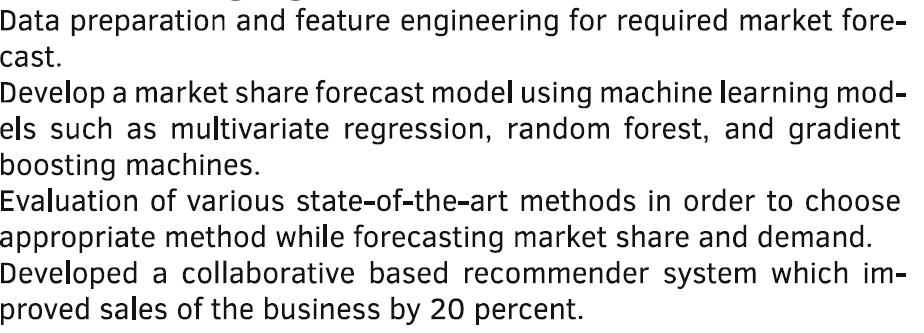

# OCR
Optical character recognition or optical character reader is the electronic or mechanical conversion of images of typed, handwritten or printed text into machine-encoded text, whether from a scanned document, a photo of a document, a scene-photo or from subtitle text superimposed on an image.
In this characters are extracted from the images and recognize through machine learning techniques and then written to the word file.IN this OCR, small and capital alphabet and 0-9 numbers are been recognized by the model. 

# Action/Result
- First the character coordinate are extarcted from the images and then sorted based on the locations.
- Bounding box is calculated using the coordinate and cropped the image.
- All the cropped images are passed through a convolutional neural network to recognize each character.
- Predicted texts are then written to the word file.
- Model accuracy about 91%

# Visual Result

# Language Used
Python, Tensorflow

# Coming Updates
- To Improve word predictions.
